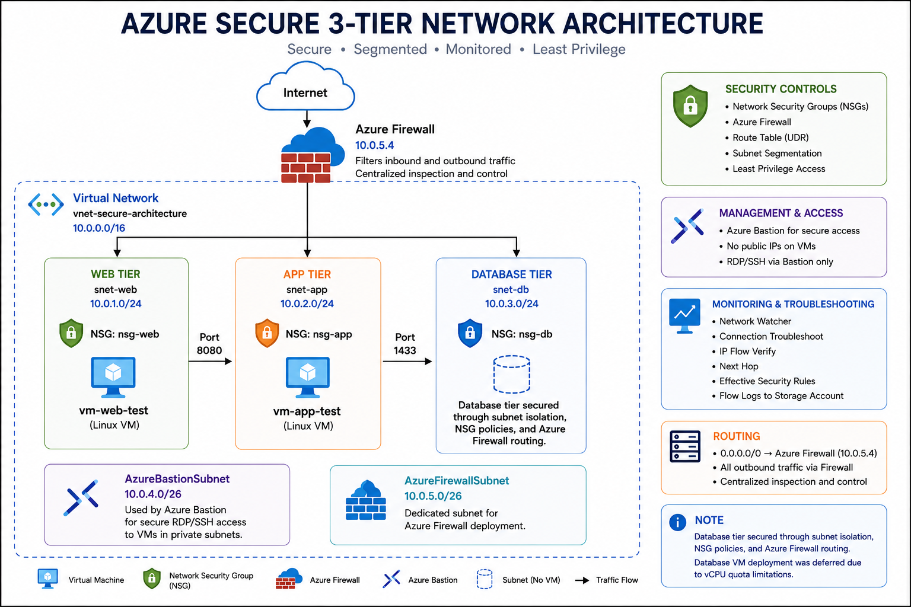
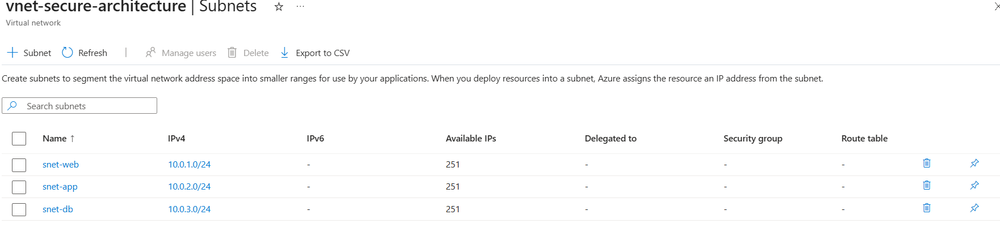
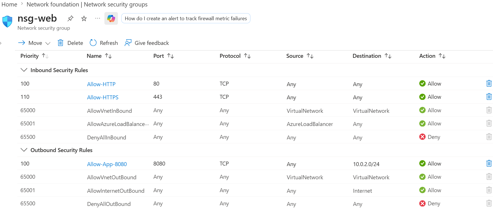
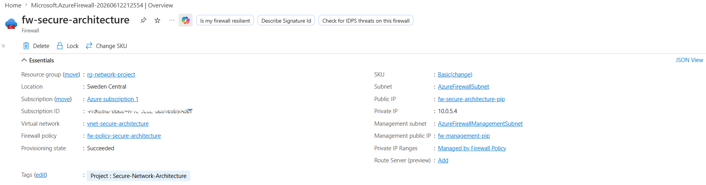
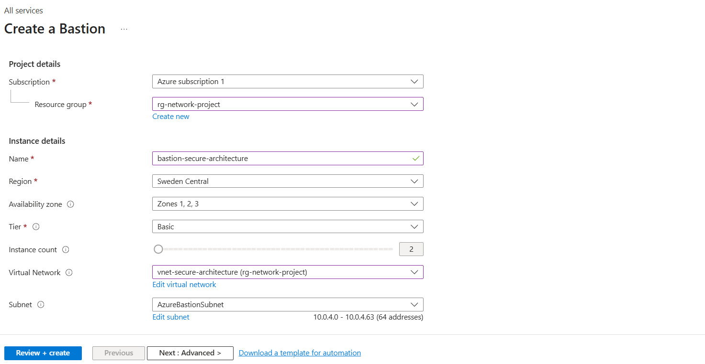
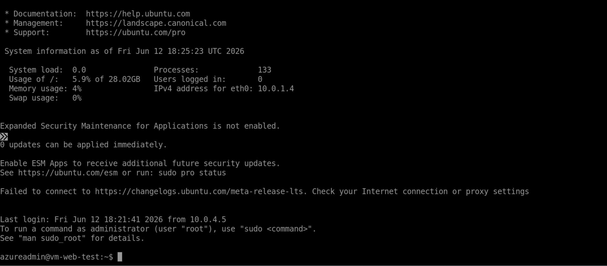
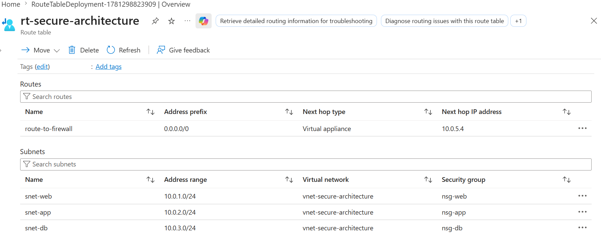
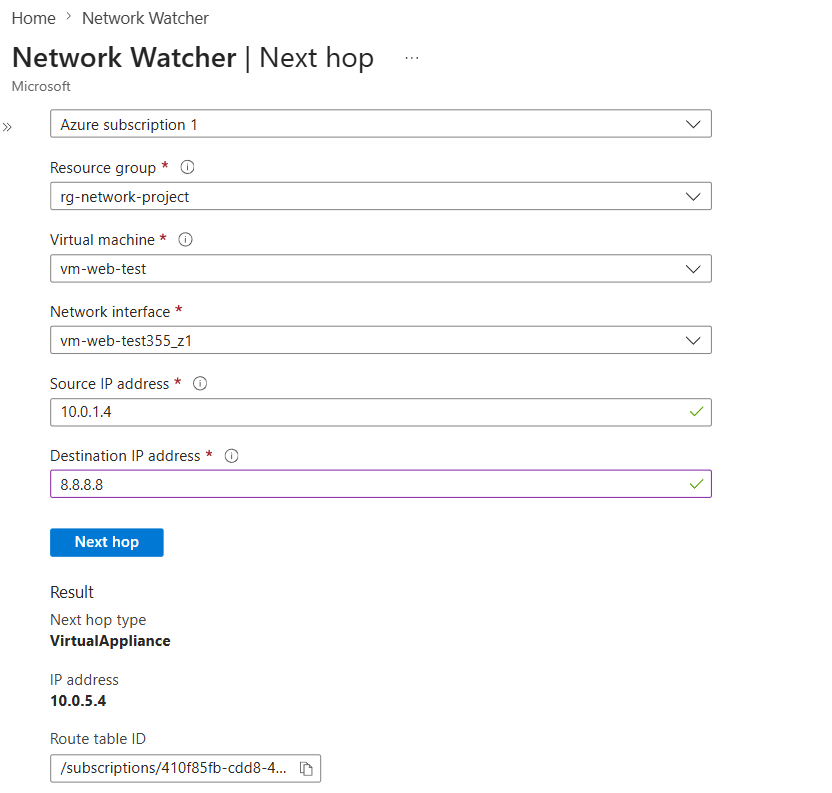

# Secure Multi-Tier Network Architecture

A secure 3-tier Azure network architecture implementing network segmentation, least-privilege access, Azure Bastion, Azure Firewall, and Network Watcher diagnostics.

Built as part of my Azure AZ-104 and AZ-500 cloud security portfolio.

---

## Overview

This project demonstrates the design and deployment of a secure enterprise-style network architecture in Microsoft Azure using security best practices.

The environment implements:

* Multi-tier network segmentation
* Network Security Groups (NSGs)
* Azure Bastion secure administration
* Azure Firewall traffic inspection
* Route tables and forced tunnelling
* Network Watcher diagnostics and monitoring
* Flow Logs for network visibility

The project focused on building a secure Azure network and validating that security controls, routing, and connectivity behaved as expected.

---

## Architecture Components

| Component            | Name                          | Address / Details |
| -------------------- | ----------------------------- | ----------------- |
| Resource Group       | `rg-network-project`          | Project resources |
| Region               | `Sweden Central`              | Azure Region      |
| Virtual Network      | `vnet-secure-architecture`    | `10.0.0.0/16`     |
| Web Tier Subnet      | `snet-web`                    | `10.0.1.0/24`     |
| App Tier Subnet      | `snet-app`                    | `10.0.2.0/24`     |
| Database Tier Subnet | `snet-db`                     | `10.0.3.0/24`     |
| Bastion Subnet       | `AzureBastionSubnet`          | `10.0.4.0/26`     |
| Firewall Subnet      | `AzureFirewallSubnet`         | `10.0.5.0/26`     |
| Azure Firewall       | `fw-secure-architecture`      | `10.0.5.4`        |
| Azure Bastion        | `bastion-secure-architecture` | Secure SSH access |

---

## Security Controls

### Network Security Groups (NSGs)

Network Security Groups were used to enforce least-privilege communication between network tiers.

* Internet traffic is restricted to the Web Tier.
* Application traffic is limited to required ports only.
* Database access is restricted to the Application Tier.
* Unnecessary traffic is blocked by default.

### Azure Firewall

* Centralized traffic inspection and routing.
* Dedicated Azure Firewall subnet deployment.
* Outbound traffic forced through the firewall using UDRs.

### Azure Bastion

Azure Bastion was deployed to provide secure browser-based administration without exposing SSH ports to the Internet.

* Secure browser-based VM access.
* No public IP addresses required.
* Reduced attack surface.

### Route Table (UDR)

* Default route (`0.0.0.0/0`) redirected through Azure Firewall.
* Forced tunnelling enabled for workload subnets.

---

## NSG Rules

### `nsg-web` (Web Tier)

| Direction | Port    | Source        | Destination   | Action |
| --------- | ------- | ------------- | ------------- | ------ |
| Inbound   | 80, 443 | Internet      | `10.0.1.0/24` | Allow  |
| Outbound  | 8080    | `10.0.1.0/24` | `10.0.2.0/24` | Allow  |

### `nsg-app` (Application Tier)

| Direction | Port | Source        | Destination   | Action |
| --------- | ---- | ------------- | ------------- | ------ |
| Inbound   | 8080 | `10.0.1.0/24` | `10.0.2.0/24` | Allow  |
| Outbound  | 1433 | `10.0.2.0/24` | `10.0.3.0/24` | Allow  |

### `nsg-db` (Database Tier)

| Direction | Port | Source        | Destination   | Action |
| --------- | ---- | ------------- | ------------- | ------ |
| Inbound   | 1433 | `10.0.2.0/24` | `10.0.3.0/24` | Allow  |
| Inbound   | Any  | Internet      | `10.0.3.0/24` | Deny   |

---

## Virtual Machines

| VM            | Tier     | OS    |
| ------------- | -------- | ----- |
| `vm-web-test` | Web Tier | Linux |
| `vm-app-test` | App Tier | Linux |

The virtual machines were used to validate NSG rules, routing, and secure access through Azure Bastion.

> Database tier secured through subnet isolation, NSG policies, and Azure Firewall routing. Database VM deployment was deferred due to vCPU quota limitations.

---

## Validation & Testing

Azure Network Watcher was used to validate security controls and troubleshoot network behaviour.

### IP Flow Verify

Validated that NSG rules correctly allowed and denied traffic between network tiers.

### Next Hop Validation

The Next Hop diagnostic confirmed that Internet-bound traffic is routed through Azure Firewall (`10.0.5.4`).

### Diagnostics Performed

* IP Flow Verify
* Effective Security Rules
* Connection Troubleshoot
* NSG Flow Logs
* Next Hop Analysis

---

## Challenges & Honest Notes

* Database VM deployment was deferred due to vCPU quota limitations in the subscription.
* Despite not deploying a database VM, the database tier was fully designed with subnet isolation, NSG rules, and firewall routing.
* Azure Network Watcher diagnostics were used to validate routing, connectivity, and security controls after deployment.

---

## What I Learned

* How subnet segmentation reduces the attack surface.
* How NSGs control east-west traffic between tiers.
* How Azure Firewall and route tables work together.
* Why Azure Bastion is safer than exposing SSH to the Internet.
* How Azure Network Watcher helps validate and troubleshoot connectivity.

---

## AZ-104 Objectives Covered

* Configure and manage virtual networking
* Configure Network Security Groups
* Configure Azure Firewall
* Configure routing
* Deploy and manage virtual machines
* Monitor and troubleshoot connectivity

---

## AZ-500 Objectives Covered

* Secure network access
* Network segmentation and isolation
* Implement NSG rules
* Deploy Azure Firewall
* Secure administration with Azure Bastion
* Monitor and validate security controls

---

## Tools Used

* Microsoft Azure Portal
* Azure Virtual Network
* Network Security Groups (NSGs)
* Azure Bastion
* Azure Firewall
* Route Tables (UDRs)
* Azure Network Watcher
* Flow Logs
* Storage Account
* Linux Virtual Machines

